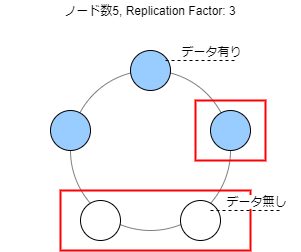
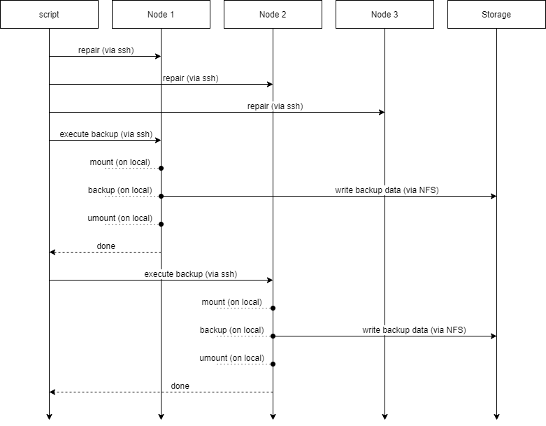
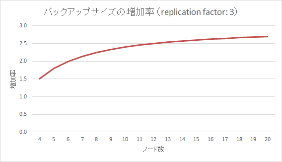

# Cassandra バックアップ方式

複数ノードのバックアップを取得する。  
※レプリケーションファクタが適切に設定されていることを想定する。  

本方式では次の点を実現する。
1. 自動的にバックアップに必要なノード数とノードを決定できる
2. リモートで対象ノードの Snapshot を取得できる
3. 各ノードで取得したアーカイブファイルを共通の場所に保存できる
4. 各ノードでアーカイブファイルを区別できる
5. アーカイブファイルが世代管理され、世代上限を超えた古いアーカイブを自動削除できる


## バックアップノード数の計算方法

バックアップノード数は次の計算式となる。  
（単一 DC の）クラスターのノード数とレプリケーションファクタに基づき、  
全データをバックアップするために必要な最小のノード数を求める。

```
max(1, nodes - replication-factor + 1)
```

※ ここで式の各項には次の意味がある。
- `nodes - replication-factor`：  
  データのレプリカが存在しないノードの数
- `+ 1`：  
  少なくとも1ノードにはレプリカが存在する
- `max(1, ...)`:  
  `nodes`や`replication-factor`に不整合がある場合もで必ず1台を選択する
  


例えば、ノード数が5、レプリケーションファクタが3 の場合は次のように3台をバックアップ対象とする。
```
max(1, 5 - 3 + 1) = 3
```

## バックアップ処理の流れ

mount => backup（Snapshot,mv,rotate）= unmount は、 1 セットで実行する必要があり、途中で処理が中断すると障害が連鎖する可能性がある。
具体的には全て個別にリモート実行される方式の場合 backup の途中で通信障害により処理が中断してしまうと unmount が実行されずにマウントされた状態のまま次回バックアップ実行を迎えてしまうため、ここでエラーになる。

対策として、各ノードにこの一連の処理を行うスクリプトを配置する。このスクリプトはバックアップジョブ全体をコントールするスクリプトから ssh 経由で実行する。
ローカル実行される unmount は trap を使ってスクリプトが EXIT するときに実行されるようにし、たとえ途中で ssh の通信が途切れて処理が中断したとしても確実に unmount が実行されるようにする。




## バックアップファイルの使用量

ノード数3、レプリケーションファクタ3 を基準として、  
ノード数を増加させた場合のバックアップファイルの使用量の増加率を示す。

```
(replication_factor / nodes) * backup_nodes
```

- `(replication_factor / nodes)`:  
  ユニークなデータのうち、単一のノードが持つデータ量の割合 
- `backup_nodes`:  
  バックアップ対象のノード数

例えば、`replication_factor= 3`, `nodes = 4` の場合、
`backup_nodes` を最低限の 2 とすると、次のように1.5倍となる。  
つまり、ノード数4の場合はノード数3の場合に比べて1.5倍のバックアップファイルの容量となる。

```
(3/4) * 2 = 1.5
```

`backup_nodes` を最低限の値にする場合には上記の概算式を変形して、
`replication_factor` と `nodes` で構成された下記の概算に変形できる。

`replication_factor * (1 - (replication_factor - 1)/nodes)`

この式をグラフにすると次のようになる。



## 使用方法

バックアップとリストア方法は次のドキュメントから確認できる。
- [Cassandraバックアップ]
- [Cassandraリストア]

## ソースコード

本方式を実現したバックアップスクリプトは、Cassandraノードそれぞれにインストールされている。  
[ソースコード] も確認できる。

[ソースコード]: /modules/service/redhat/core/resources/cassandra/backup
[Cassandraバックアップ]: /docs/ops/Cassandraバックアップ.md
[Cassandraリストア]:  /docs/ops/Cassandraリストア.md
