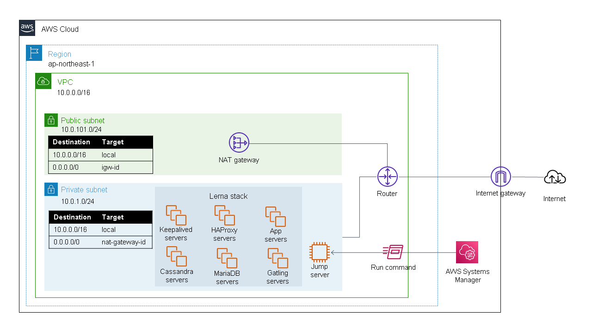

# Lerna AWS VPC Example

lerna-stack AWS版モジュール `platform/aws/ec2` を AWS VPC にデプロイするための環境を構築します。  
このサンプルでは、リージョン `ap-northeast-1` に 次のリソースを作成もしくは使用します。

- 1つの Virtual Private Cloud (`10.0.0.0/16`)
- 1つの Availability Zone (`ap-northeast-1a`)
- 1つの Public Subnet (`10.0.101.0/24`)
- 1つの Private Subnet (`10.0.1.0/24`)
- 1つの Internet Gateway
- 1つの NAT Gateway
- 1つの Jump Server (踏み台サーバ)

このサンプルは開発用環境を構築する例を示すことを意図しています。本番環境での利用は想定していないことにご注意ください。
このサンプルは lerna-stack を構成するすべてのサーバを Private Subnet (`10.0.1.0/24`) に配置することを想定しています。
そのため、これらのサーバにインターネットからリクエストを送ることができません。
これらのサーバーにリクエストを送るためには、踏み台サーバなどの Private Subnet に接続しているコンピュータを使う必要があります。



## 制約

lerna-stack AWS版モジュール `platform/aws/ec2` には次の制約があります。

- リージョン は `ap-northeast-1` のみをサポートします。
- 1つの Virtual Private Cloud 、1つの Availability Zone、1つの Subnet のみをサポートします。  
  このサンプルでは Private Subnet (`10.0.1.0/24`) に lerna-stack を構築することを想定しています。
- サブネット内から外部サーバ(例えばyumリポジトリ等)に接続できる必要があります。  
  このサンプルでは、Public Subnet (`10.0.101.0/24`)、Internet Gateway、NAT Gateway を構築することでこれを実現しています。
- サブネット(`10.0.1.0/24`)に対して `ssh` 接続できる必要があります。  
  このサンプルではプライベートサブネット内に踏み台サーバを構築しており、  
  そのインスタンスにssh接続してから `platform/aws/ec2` を使った設定を `apply` することを想定しています。

## 前提条件

`terraform` を実行するための適切な権限を持った IAM とそのアクセスキー、シークレットキーが必要です。  
IAM には以下に記載の権限が付与されている必要があります。

### Terraform を実行する IAM を作成する

IAM を作成してください。  
作成した IAM にはビルトインの PowerUserAccess ポリシーを設定します。

### modules/security を使用するためのポリシーを IAM に付与する

次のような IAM Policy を作成し、IAM に付与します。

```json
{
    "Version": "2012-10-17",
    "Statement": [
        {
            "Sid": "EditSpecificServiceRole",
            "Effect": "Allow",
            "Action": [
                "iam:CreateRole",
                "iam:DeleteRole",
                "iam:DeleteRolePolicy",
                "iam:GetRole",
                "iam:GetRolePolicy",
                "iam:ListInstanceProfilesForRole",
                "iam:PutRolePolicy",
                "iam:TagRole"
            ],
            "Resource": "*"
        }
    ]
}
```

### modules/jump_instance を使用するためのポリシーを IAM に付与する

次のような IAM Policy を作成し、IAM に付与します。

```json
{
  "Version": "2012-10-17",
  "Statement": [
    {
      "Sid": "Stmt1607393245000",
      "Effect": "Allow",
      "Action": [
        "iam:AddRoleToInstanceProfile",
        "iam:AttachRolePolicy",
        "iam:CreateInstanceProfile",
        "iam:DeleteInstanceProfile",
        "iam:DetachRolePolicy",
        "iam:GetInstanceProfile",
        "iam:GetPolicy",
        "iam:GetPolicyVersion",
        "iam:ListAttachedRolePolicies",
        "iam:PassRole",
        "iam:RemoveRoleFromInstanceProfile"
      ],
      "Resource": [
        "*"
      ]
    }
  ]
}
```

## 使い方

### `terraform.tfvars` を作成する

`terraform.tfvars.example` をコピーすることで、`terraform.tfvars` を作成します。

```shell
cp terraform.tfvars.example terraform.tfvars
```

必要に応じて、設定項目を書き換えてください。

### `assets`ディレクトリに 公開鍵、秘密鍵 を作成する

踏み台サーバ (`jump_instance`) に ssh接続をするために必要な 公開鍵、秘密鍵 を作成します。
鍵の名前は 秘密鍵(`id_rsa`), 公開鍵(`id_rsa.pub`) にします。  
次のコマンドで鍵を作成できます。

```shell
ssh-keygen -f ./assets/id_rsa
```

鍵のファイル名は変更することが可能です。  
変更する場合は `terraform.tfvars` にある設定項目 `ssh_public_key_filepath` を変更してください。

### ローカルマシンのsshを設定する

ローカルマシンのsshの設定ファイルに AWS Session Manager を通して SSH接続するための設定項目を追加します。

ローカルマシンが `Windows` の場合、次のような項目をsshの設定ファイルに追加します。
```conf
# SSH over Session Manager
host i-* mi-*
  ProxyCommand powershell "aws ssm start-session --target %h --document-name AWS-StartSSHSession --parameters portNumber=%p"
```
sshの設定ファイルは、通常は `~/.ssh/config` にあります。

詳細は、[ステップ 8: (オプション) Session Manager を通して SSH 接続を有効にする](https://docs.aws.amazon.com/ja_jp/systems-manager/latest/userguide/session-manager-getting-started-enable-ssh-connections.html)
を参照してください。

### `terraform` を実行する

`terraform` を使い、次のように実行することで環境を構築することができます。

```shell
terraform init
terraform plan
terraform apply
```

このサンプルでは金銭の請求される(free tier には含まれない)リソースを作成します（例えば NAT-Gateway など)。  
これらのリソースが不要な場合は、`terraform destroy` を実行して削除してください。

## Requirements

| Name | Version |
| --- | --- |
| terraform | `>= 0.14` |
| aws | `~> 3.0` |

## Providers

No Providers.

## Inputs

| Name | Description |
| ---  | --- |
| `aws_access_key` | AWS access key |
| `aws_secret_key` | AWS secret key |
| `ssh_public_key_filepath` | A file path of SSH public key |

## Outputs

| Name | Description |
| ---  | --- |
| `aws_internet_gateway_id` | The Internet Gateway ID | 
| `aws_keepalived_instance_role_name` | The IAM Role to be attached to `keepalived` server |
| `aws_vpc_id` | The VPC ID |
| `aws_vpc_nat_gateway_id` | The NAT Gateway ID |
| `aws_vpc_route_table_id_for_virtual_ips` | The Route Table ID that is edited by `HAProxy` server |
| `aws_vpc_security_group_id` | The Security Group ID |
| `aws_vpc_subnet_id` | The Private Subnet ID | 
| `jump_instance_id` | The EC2 Instance ID of the jump server |
| `jump_instance_username` | The login username of the jump server |
| `ssh_private_key_filepath` | The file path of SSH private key (which is guessed from public one) |

## Tips

### `jump_instance` に `ssh` で接続するには？

次のコマンドを実行します。
```shell
./scripts/ssh_jump_instance.sh
```

### `jump_instance` に `scp` でファイルを転送するには？

次のコマンドを実行します。
```shell
./scripts/scp_jump_instance.sh /your/file/path
```
